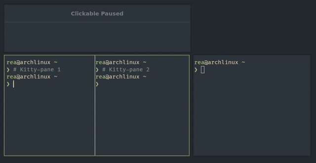

# Hyprland + Kitty Navigation Script

> Switch focus between Kitty splits and Hyprland windows with a single hotkey.



**What It Does**

- If Kitty is the active window, it moves focus to the neighboring Kitty split.
- If Kitty is not active (or Kitty navigation fails), it falls back to Hyprland focus movement.

**Requirements**

- Python 3.12+
- `lsof`
- Hyprland
- Kitty with remote control enabled via a Unix socket

**Kitty Configuration**
Add this to your `kitty.conf`:

```conf
allow_remote_control socket-only
listen-on unix:/tmp/kitty
```

**Usage**
Run directly:

```bash
./hypr_kitty_nav.py left
./hypr_kitty_nav.py right
./hypr_kitty_nav.py up
./hypr_kitty_nav.py down
```

**Example Hyprland Keybinds**

```ini
# ~/.config/hypr/hyprland.conf
bind = SUPER, H, exec, /path/to/hypr_kitty_nav.py left
bind = SUPER, L, exec, /path/to/hypr_kitty_nav.py right
bind = SUPER, K, exec, /path/to/hypr_kitty_nav.py up
bind = SUPER, J, exec, /path/to/hypr_kitty_nav.py down
```

**Notes**

- The script uses `HYPRLAND_INSTANCE_SIGNATURE` and `XDG_RUNTIME_DIR` to locate the Hyprland socket.
- If Kitty has no sockets under `/tmp/kitty*`, the script immediately falls back to Hyprland.

**Troubleshooting**

- Ensure Kitty is running with the socket enabled and accessible at `/tmp/kitty*`.
- Ensure `lsof` is installed and available in `PATH`.
- To enable debug logs, set `DEBUG = True` in `hypr_kitty_nav.py` and read `/tmp/hypr_kitty_nav.log`.
