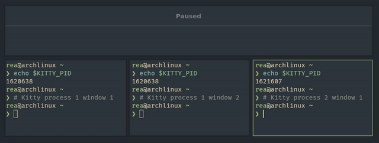

# Kitty launch



> Keep one main Kitty instance and open new tabs into it from Hyprland keybinds.

## 📋 What It does

- Starts the first Kitty as a UWSM service with a fixed socket and window class.
- Subsequent runs open a new Kitty tab in that main window.
- Focuses the main Kitty window after launching.
- Rewrites the first `-d` argument to `--cwd` for `kitty @ launch` compatibility.

## 🧱 Requirements

- Hyprland running under UWSM
- Kitty with remote control (the script enables socket-only control on first launch)
- Python 3.13+ (project requirement)

## 🚀 Installation

```bash
git clone https://github.com/Reagent992/hyprland_scripts.git
cd hyprland_scripts
chmod u+x kitty_launch.py
```

## 🛠️ Usage

```bash
kitty_launch.py [kitty arguments...]
```

```ini
# hyprland.conf
$kitty_main = /path/to/kitty_launch.py

bind = SUPER, T, exec, [workspace 2] $kitty_main
bind = SUPER, Y, exec, [workspace 2] $kitty_main yazi
bind = SUPER, N, exec, [workspace 2] $kitty_main -d ~/dev/foo nvim
```

## ⚙️ Configuration

Edit constants in `kitty_launch.py` if you want to customize behavior:

- `MAIN_KITTY_CLASS` controls the Hyprland class used to find and focus the main window.
- `KITTY_SOCKET_NAME` controls the socket name under `/tmp`.
- `DEBUG` enables logging to `/tmp/kitty_launch.log`.

## 🔧 Troubleshooting

- If nothing happens, make sure `HYPRLAND_INSTANCE_SIGNATURE` is set (Hyprland under UWSM).
- Check logs in `/tmp/kitty_launch.log` for socket errors and command failures.
