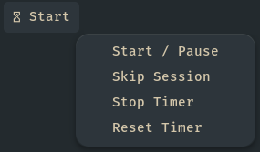

# Pomodoro

This pomodoro timer is an improved version of the timer from the repository: https://github.com/Tejas242/pomodoro-for-waybar .



## Setup

```jsonc
// waybar's config.jsonc
  "custom/pomodoro": {
    "exec": "~/path/to/pomodoro.py",
    "on-click": "~/path/to/pomodoro.py toggle",
    "return-type": "json",
    "interval": 1,
    "format": "{}",
    "menu": "on-click-right",
    "menu-file": "~/path/to/pomodoro-menu.xml",
    "menu-actions": {
      "toggle": "~/path/to/pomodoro.py toggle",
      "skip": "~/path/to/pomodoro.py skip",
      "stop": "~/path/to/pomodoro.py stop",
      "reset": "~/path/to/pomodoro.py reset",
    },
  },
```

```css
/* style.css */
menu {
  border-radius: 15px;
  background: #2d353b;
  color: #d3c6aa;
}
menuitem {
  border-radius: 15px;
}
```

## Info

You shouldnt't use it at two waybars(two monitors) at the same time, due to a change of the race condition.
