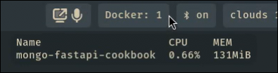

# waybar_docker_status

> Script for Waybar that displays information about running Docker containers. If any containers are running, the script shows their count along with CPU and memory usage stats for each container in a formatted table. If Docker is not running, it outputs an appropriate status message.



## waybar's config.jsonc

1. make script executable `chmod u+x waybar_docker_status.py`
2. place it to your `config.jsonc`

```json
  "modules-right": [
    "custom/docker",
  ],
  "custom/docker": {
    "exec": "~/.config/waybar/scripts/waybar_docker_status.py",
    "return-type": "json",
    "interval": 60,
  },
```
